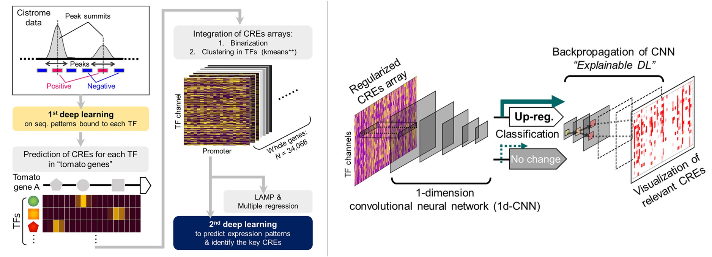

# Genome-wide cis-decoding for expression design in tomato using cistrome data and explainable deep learning  (Pytorch implementation)

Takashi Akagi*, Kanae Masuda*, Eriko Kuwada*, Kouki Takeshita, Taiji Kawakatsu, Tohru Ariizumi, Yasutaka Kubo, Koichiro Ushijima, Seiichi Uchida
(*Equal contribution)
[[Publishersite](https://academic.oup.com/plcell/article/34/6/2174/6542321)]



> In the evolutionary history of plants, variation in cis-regulatory elements (CREs) resulting in diversification of gene expression has played a central role in driving the evolution of lineage-specific traits. However, it is difficult to predict expression behaviors from CRE patterns to properly harness them, mainly because the biological processes are complex. In this study, we used cistrome datasets and explainable convolutional neural network (CNN) frameworks to predict genome-wide expression patterns in tomato (Solanum lycopersicum) fruit from the DNA sequences in gene regulatory regions. By fixing the effects of trans-acting factors using single cell-type spatiotemporal transcriptome data for the response variables, we developed a prediction model for crucial expression patterns in the initiation of tomato fruit ripening. Feature visualization of the CNNs identified nucleotide residues critical to the objective expression pattern in each gene, and their effects were validated experimentally in ripening tomato fruit. This cis-decoding framework will not only contribute to the understanding of the regulatory networks derived from CREs and transcription factor interactions, but also provides a flexible means of designing alleles for optimized expression.

This repository is a pytorch implementation of [here](https://github.com/Takeshiddd/CisDecoding_cistrome).

## Requirements
* python >= 3.9
* cuda && cudnn

We strongly recommend using a virtual environment like Anaconda or Docker. The following is how to build the virtual environment for this code using anaconda.
```
# Pytorch install: see https://pytorch.org/get-started/locally/
# For example,
$ pip3 install torch torchvision torchaudio --index-url https://download.pytorch.org/whl/cu118
$ pip install -r requirements.txt
```

## Training & Test
0. Please place the following two files in the `./data` directory.
- Fasta file
```
# ./data/sample_data.fa
>LG10:10024102-10026102
GAAATAACATCAGAATAGTGACAAGCACTCT..
>LG10:10083895-10085895
AATACTCTAAGGGGCAAAGTGTAGTTAGCGA..
>LG10:10102616-10104616
：
```
- Target binary expression pattern file (tab-delimited)
```
# ./data/sample_label.txt
LG11:8580379-8582379	1
LG11:8734084-8736084	1
：
LG11:8784721-8786721	0
LG11:8790102-8792102	0
：
```

1. Execute 1st-DL.
```
$ python src/main_1stDL.py --data_dir='data/' --fasta_file='sample_data.fa' --length=2001 --output_dir='result/'
```

2. (optional) Output 1st-DL results to csv file for each gene. If the number of genes is large, this may take a lot of time (a few hours). You can proceed without this run.
```
$ python src/to_csv_1stDL.py --data_dir='data/' --fasta_file='sample_data.fa' --output_dir='result/'
```
Output example
- `1st-pred-csv/(gene name).csv` shows the TF-binding peaks.

|                        | ABF2_col_v3a | ABI5_colamp_v3b | …  | 
| ---------------------- | ------------ | --------------- | --- | 
| CTCTTCCTCTTCCTAGGTAATTTTGCAATAG   |              |                 |     | 
| CTTCCTCTTCCTAGGTAATTTTGCAATAGAA |              |                 |     | 
| TCCTCTTCCTAGGTAATTTTGCAATAGAAAC   |              |                 |     | 
| ：                     |              |                 |     | 


3. Execute 2nd-DL.
```
$ python src/main_2ndDL.py --data_dir='data/' --fasta_file='sample_data.fa' --label_file='sample_label.txt' --output_dir='result/'
$ python src/guidedBP.py --data_dir='data/' --fasta_file='sample_data.fa' --output_dir='result/'
```
Output example
- `roc_curve.png` shows AUC and ROC curve.
- `2ndDL_prediction_test.csv` shows the expression prediction for test data.

|                        | prediction |
| ---------------------- | ------------ | 
| LG23:16262091-16264091   |              |                
| LG3:18503076-18505076 |              |                
| LG12:12982766-12984766   |              |                 |   
| ：                     |              |                

- `2nd-pred-csv/(gene name).csv` shows the relevance between transcription factor and promoter region for each expression data.

|                        | 0 | 1 | …  | 
| ---------------------- | ------------ | --------------- | --- | 
| ABF2_col_v3a   |              |                 |     | 
| ABI5_colamp_v3b |              |                 |     | 
| ABR1_col_a   |              |                 |     | 
| ：                     |              |                 |     | 

## Citation
If you find this repository helpful, please consider citing:
```
@article{10.1093/plcell/koac079,
    author = {Akagi, Takashi and Masuda, Kanae and Kuwada, Eriko and Takeshita, Kouki and Kawakatsu, Taiji and Ariizumi, Tohru and Kubo, Yasutaka and Ushijima, Koichiro and Uchida, Seiichi},
    title = {Genome-wide cis-decoding for expression design in tomato using cistrome data and explainable deep learning},
    journal = {The Plant Cell},
    volume = {34},
    number = {6},
    pages = {2174-2187},
    year = {2022},
    month = {03},
}
```